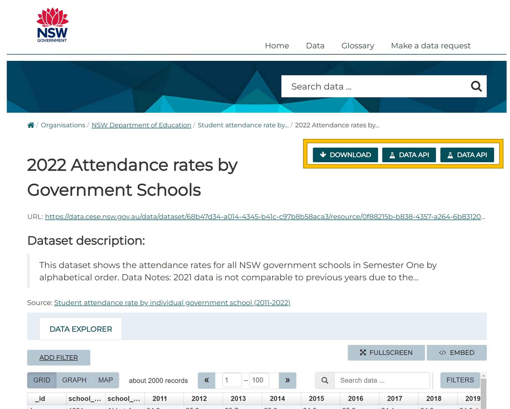

# New South Wales Department of Education (NSW DOE) - Data Case Study 🦘

[](https://codespaces.new/wisemuffin/nsw_doe_data_case_study?quickstart=1)
[](https://gitpod.io/#https://github.com/wisemuffin/nsw_doe_data_case_study)


[New South Wales Department of Education (NSW DOE)](https://education.nsw.gov.au/) are looking for humans who are passionate about improving education.

We created this case study for our aspiring data team members to show off some data skills and use some of the data we work with. We recommend beginners use the following steps to open this project right here on GitHub in a Codespace. If you're a little more experienced with devcontainers and want to go faster 🏎️, you can use the Gitpod link above for a quicker startup and deeper feature set.

**We want this case study to be as seamless as possible and take as little of your time as possible.** That’s why we are using github code spaces which instantly sets up the same environment for you.

Find out more about the [NSW Department of Education](https://education.nsw.gov.au/)

## What are we testing?

	- Your ability to solve problems
	- SQL modelling. Its only 2 datasets don’t go crazy. We are not fussed on what data modelling technique (dimensional, one big table, ect)
	- Data analysis. Give us your opinions and insights on what you find in the data
	- Document your work (nothing fancy, a simple README.md file is more than enough)
    - Work with version control (git)

# The Case Study

## Step 1 - Setup the case study environment

### 1.a Click the big green 'Use this template' button and 'Create a new repository'.


This will create a new repository exactly like this one, and navigate you there. Make sure to execute the next instructions in that repo.

### 1.b Click 'Code', then 'Codespaces, then 'Create codespace on main'.


This will create a new `codespace`, a sandboxed devcontainer with everything you need for a dbt project. Once the codespace is finished setting up, you'll be ready to run a `dbt build`.

### 1.c Make sure to wait til the codespace is finished setting up.


After the container is built and connected to, VSCode will run a few clean up commands and then a `postCreateCommand`, a set of commands run after the container is set up. This is where we install our dependencies, such as dbt, the duckdb adapter, and other necessities, as well as run `dbt deps` to install the dbt packages we want to use. That screen will look something like the above. When it's completed it will close and leave you in a fresh terminal prompt. From there you're ready to do some analytics engineering!

## Step 2 - Investigating data already loaded into the database

[public_school_nsw_master_dataset](https://data.cese.nsw.gov.au/data/dataset/nsw-public-schools-master-dataset) has already been loaded into the database which contains NSW public school fields. To run some SQL lets first get into the `duckdb cli` by entering the following into the command line:

```bash
task duck
```
Then lets run some sql via the `duck cli` to quickly review how to issue sql commands via duckdb:

```sql
select * from public_school_nsw_master_dataset;
```
DuckDB primarily uses the SQL standard. For some examples see [duckdb sql](https://duckdb.org/docs/sql/introduction).
**when using the CLI** you need to include a semi colon `;` at the end of each statement.

## Step 3 - Ingest data

### 3.a Explore the data

Ontop of the [public_school_nsw_master_dataset](https://data.cese.nsw.gov.au/data/dataset/nsw-public-schools-master-dataset) preloaded into our warehouse lets bring in two more data sets. First preview the data for some initial data profiling, nice! Simply click on each link to preview the data:

[2022 Attendance rates by Government Schools](https://data.cese.nsw.gov.au/data/dataset/student-attendance-rate-by-school/resource/0f88215b-b838-4357-a264-6b83120065ba)

[2022 Multi age_composite classes](https://data.cese.nsw.gov.au/data/dataset/multi-age-or-composite-classes-in-nsw-government-schools/resource/30dd6e15-2333-427c-9952-9b7a2190ded0)

## 3.b Download the data

Feel free to choose to either download the data locally or connect to the APIs to get the data:



> **Not familiar with working on Linux?**
>
> No worries, we mostly use windows too. You can simply run the `wget` command like so to download the data localy:
>
> `wget <url> -O ./data/<name of file>`
>
> example: 
> ```bash
> wget https://data.cese.nsw.gov.au/data/dataset/027493b2-33ad-3f5b-8ed9-37cdca2b8650/resource/2ac19870-44f6-443d-a0c3-4c867f04c305/download/master_dataset.csv -O ./data/public_school_nsw_master_dataset.csv
> ```
>


### 3.c Ingest the data
Several options:

[Duckdb csv import method](https://duckdb.org/docs/guides/import/csv_import)
[Duck db via pandas dataframe](https://duckdb.org/docs/guides/python/import_pandas)
Loads of other options see [duckdb guides](https://duckdb.org/docs/guides/index)

# Tools included

This template includes additional tools for the other parts of the stack to create a more realistic experience:

- BI reporting built with [Evidence](https://evidence.dev) - an open source, code-based BI tool to write reports with markdown and SQL.

### Evidence

With Evidence you can:

- Version control your BI layer
- Build reports in the same repo as your dbt project
- Deploy your reports to a static site

#### Running Evidence

To run Evidence, use:

```shell
cd reports
npm run dev
```

See the [Evidence CLI docs](https://docs.evidence.dev/cli) for more details.

You can make changes to the markdown pages in the `reports/pages` folder and see the reports update in the browser preview.

#### Learning More about Evidence

- [Getting Started Walkthrough](https://docs.evidence.dev/getting-started/install-evidence)
- [Project Home Page](https://www.evidence.dev)
- [Github](https://github.com/evidence-dev/evidence)
- [Evidence.dev Releases](https://github.com/evidence-dev/evidence/releases)


## Contributing

We welcome issues and PRs requesting or adding new features.